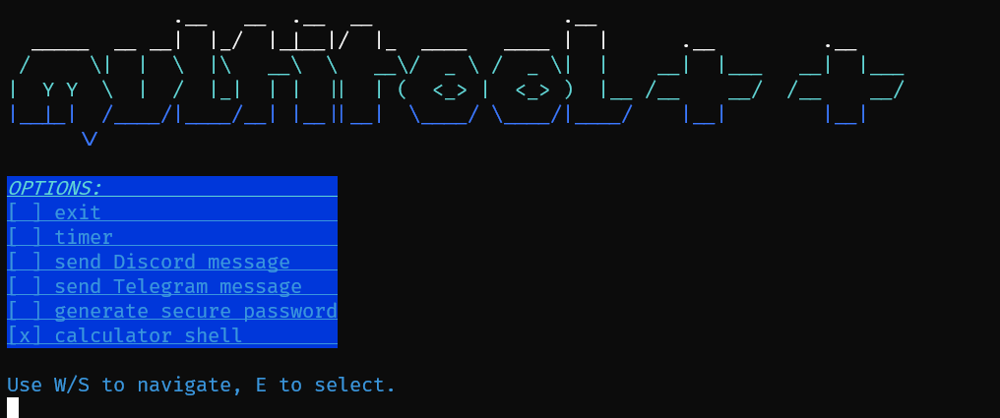

# multitool++

## Cross-platform multitool written in C++

---

We have a wiki where you can find everything you need, like instructions to build the software! Check it out [here](https://multitoolplusplus.codeberg.page/wiki).

### Screenshot (v1.1.1)

For pre-compiled binaries, you may be able to find them in artifacts of the [actions](https://github.com/multitoolplusplus/app/actions) of this repository. Only Linux pre-compiled binaries are available at the moment.