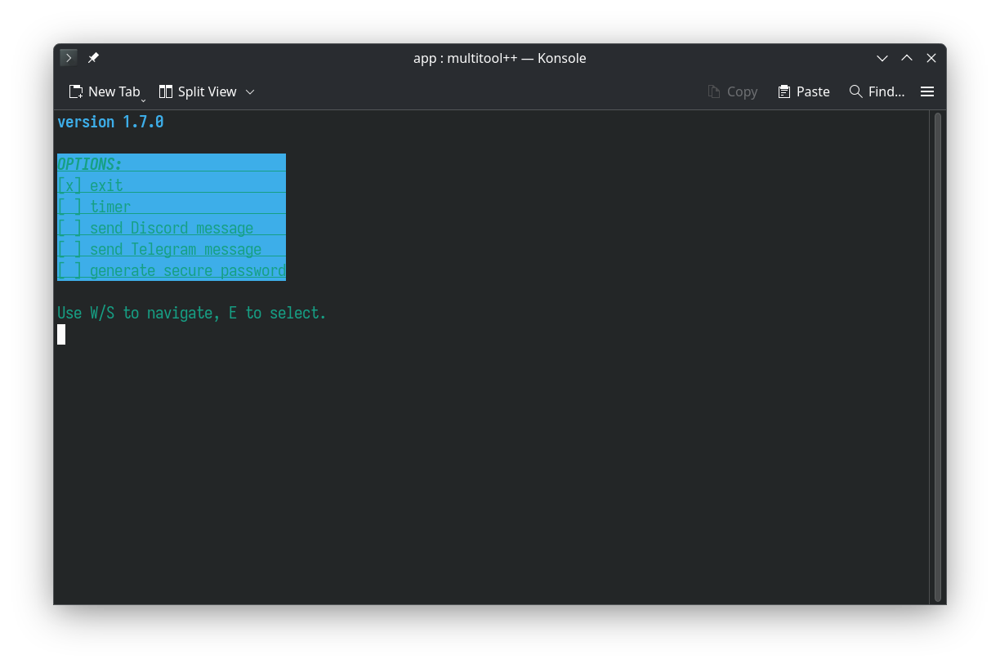

# multitool++

## Building

- Install [CMake](https://cmake.org/download/)
- Get the latest [release](https://github.com/multitoolplusplus/app/releases)
- Extract the archive
- On POSIX systems:
  - Install GCC or Clang
  - Install CMake
  - Install libcurl development files
  - Install `bc`
  - Run `build.sh`

### Screenshot (v1.7.0)

