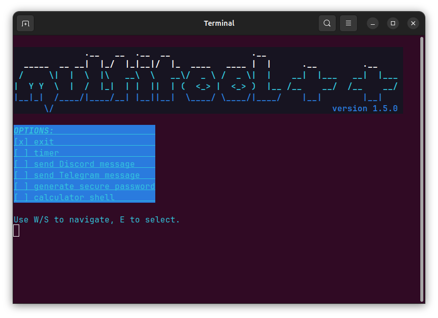

# multitool++

## Building

- Install [CMake](https://cmake.org/download/)
- Get the latest [release](https://github.com/multitoolplusplus/app/releases)
- Extract the archive
- On POSIX systems:
  - Install GCC or Clang
  - Install CMake
  - Install libcurl development files
  - Install `bc`
  - Run `build.sh`

Native Windows builds are not supported. Use Linux, macOS, BSD, or WSL.

### Dependencies

- CMake 3.10 or newer.
- A C++17 compiler.
- libcurl development files discoverable by CMake.
- bc.

### Screenshot (v1.5.0)

